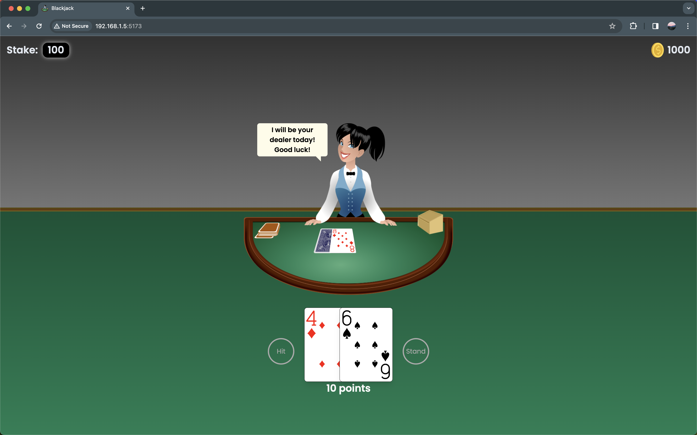
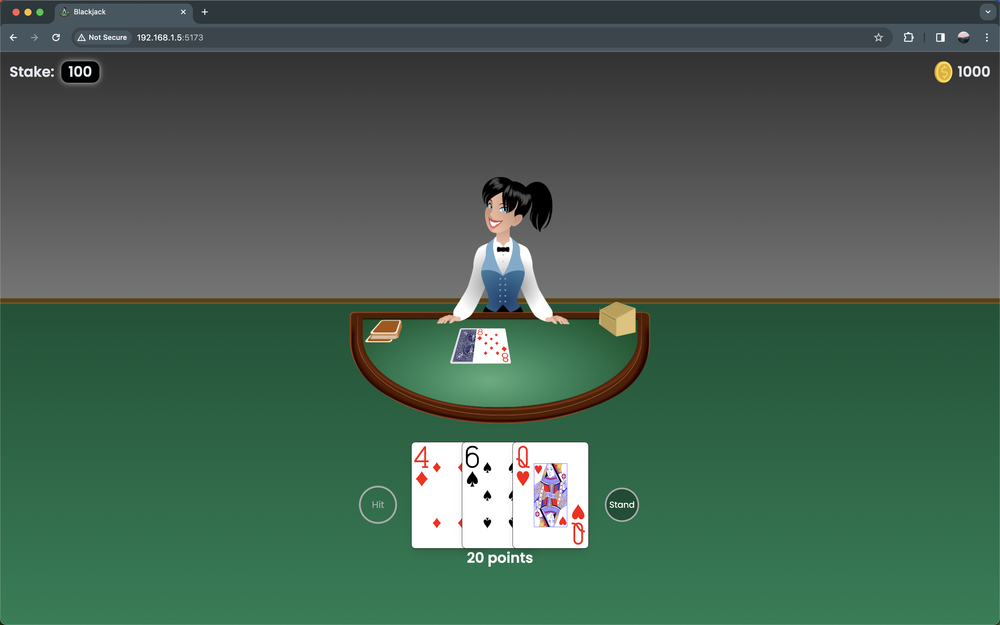
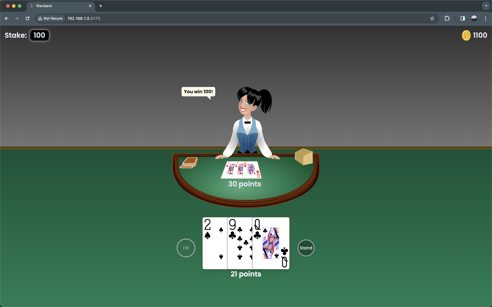
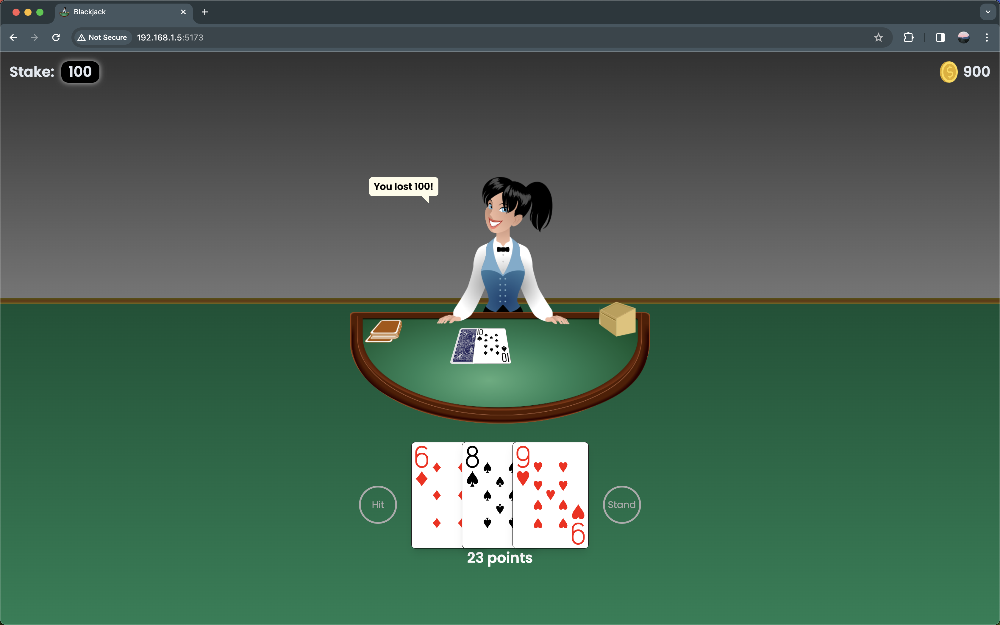
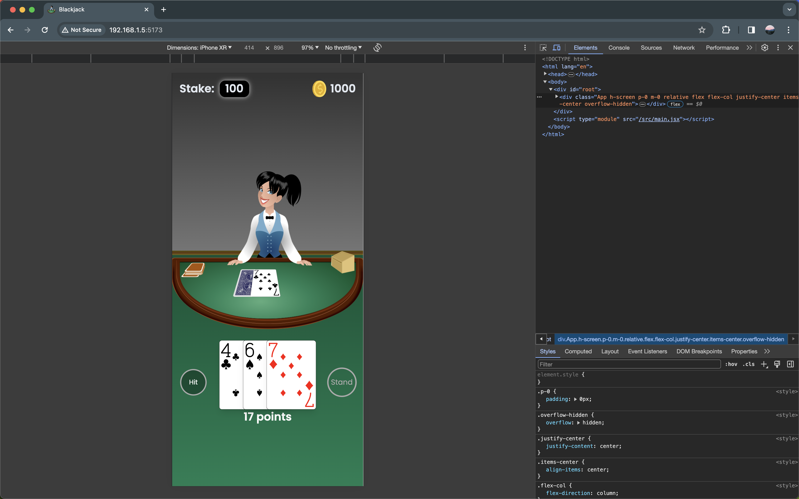

# Blackjack Game

The objective of the game is to beat the dealer. If your cards total higher than the dealer's cards without going over 21, you win. You are not trying to get close to 21. If your hand or the dealer's hand goes over 21 you "bust" and automatically lose. If you and the dealer have the same card total it's a "push" and you keep your bet.

# Installation

1. Clone the repository
2. Run `npm install` to install the dependencies
3. Run `npm run dev` to start the server

## Screenshots

